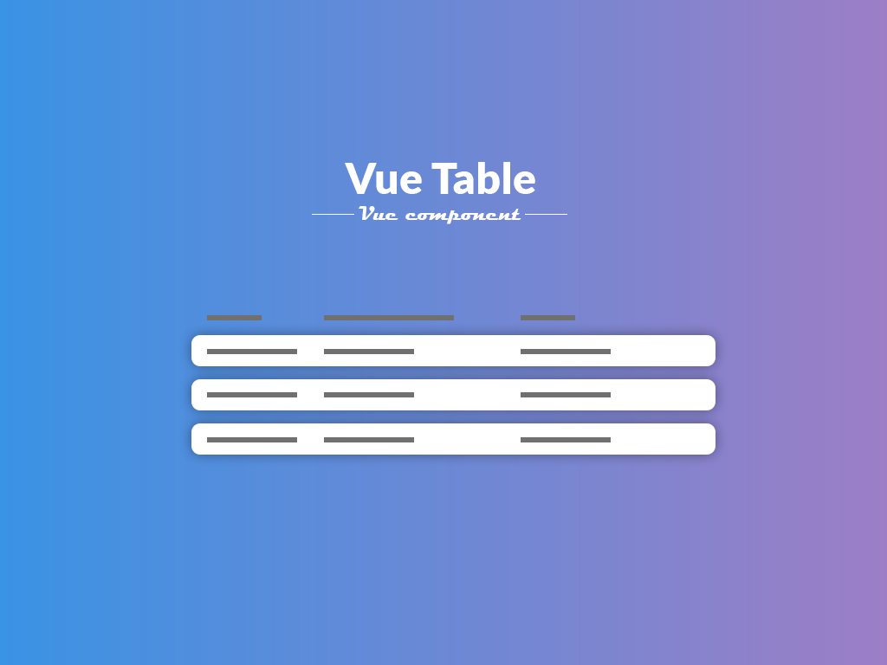

## Table of contents
* [General](#general)
* [Setup](#setup)
* [Usage](#usage)
* [Object options](#object-options)
* [Props](#props)
* [Slots](#slots)

# General
Vue table component

component is created with:
* Vue 2.6.10



# Setup
install module locally with npm or yarn

`npm i @pbartkowicz/vuetable`

or

`yarn add @pbartkowicz/vuetable`

# Usage
Import

```
import vuetable from '@pbartkowicz/vuetable'
```

Register in components section

```
components:{
    vuetable,
},
```

Define array with columns and array with items objects

```
data(){

    return{

        headers:[
            {
            label: 'Name',
            for: 'name'
            },
            {
            label: 'Surname',
            for: 'surname'
            },
            {
            label: 'Gender',
            for: 'gender'
            }
        ],

        people:[
            {
            name: 'John',
            surname: 'Doe',
            gender: 'male'
            },
            {
            name: 'Joanna',
            surname: 'Doe',
            gender: 'female'
            }
        ],

    }

}
```
In object in headers you have to define two keys:
* label - this is property to name column
* for - For what key in people array is this column

```
<vuetable :headers="headers" :items="people" />
```

You can always use rowTemplate prop to set width foreach column. 

```
<vuetable :headers="headers" :items="people" rowTemplate="33.3% 33.3% 33.3%"/>
```

# Props

| Prop              | Type   | Default | Required | Description                                                                                 |
| ----------------- | ------ | ------- | -------- | ------------------------------------------------------------------------------------------- |
| headers           | Array  |         | Yes      | Array with columns.                                                                         |
| items             | Array  |         | Yes      | Array with items.                                                                           |
| loading           | Boolean| false   | No       | Set loading statement.                                                                      |
| rowTemplate       | String |         | No       | Set column width. Use % or px and spaces between values                                     |
| rowClass          | String |         | No       | Set row class.                                                                              |
| headerClass       | String |         | No       | Set header class.                                                                           |
| rowIds            | Boolean| false   | No       | Anable dynamic id's foreach row.                                                            |
| sortable          | Boolean| false   | No       | Anable column sort ASC/DESC. Always will emmit @sort.                                       |
| pagination        | Boolean| false   | No       | Anable component build-in pagination.                                                       |
| perPage           | Number | 10      | No       | Set number of items to display.                                                             |
| paginationClass   | String |         | No       | Set pagination class.                                                                       |

# Slots
You can access to slot foreach column

```
<template v-slot:[forKeyFromHeaders]="{item}">
```

Example:
```
<vuetable :headers="headers" :items="people" rowTemplate="33.3% 33.3% 33.3%">
    <template v-slot:name="{item}">
        {{item.name}}
    </template>
</vuetable>
```

And foreach header

```
<template v-slot:HEADER_[forKeyFromHeaders]="{item}">
```

Example:
```
<vuetable :headers="headers" :items="people" rowTemplate="33.3% 33.3% 33.3%">
    <template v-slot:HEADER_name="{item}">
        {{item.name}}
    </template>
</vuetable>
```

Static slots

| Slot              | Description                                                                                 |
| ----------------- | ------------------------------------------------------------------------------------------- |
| no-records        | Slot if items array is empty.                                                               |
| back-to-first     | Slot for back to first page button in build-in pagination.                                  |
| prev              | Slot for previous page button in build-in pagination.                                       |
| next              | Slot for next page button in build-in pagination.                                           |
| go-to-last        | Slot for go to last page button in build-in pagination.                                     |